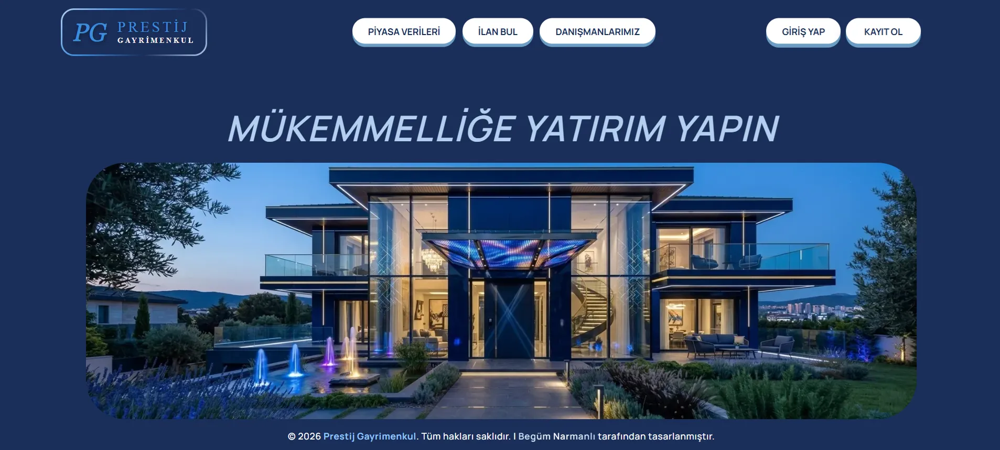
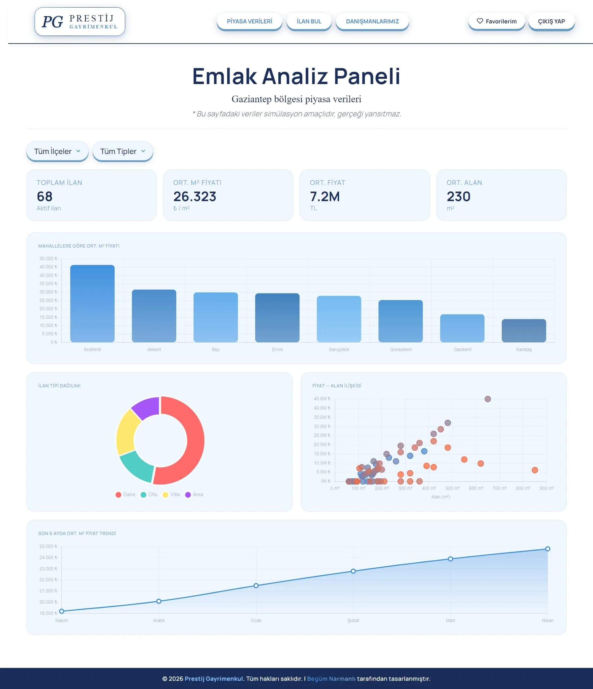
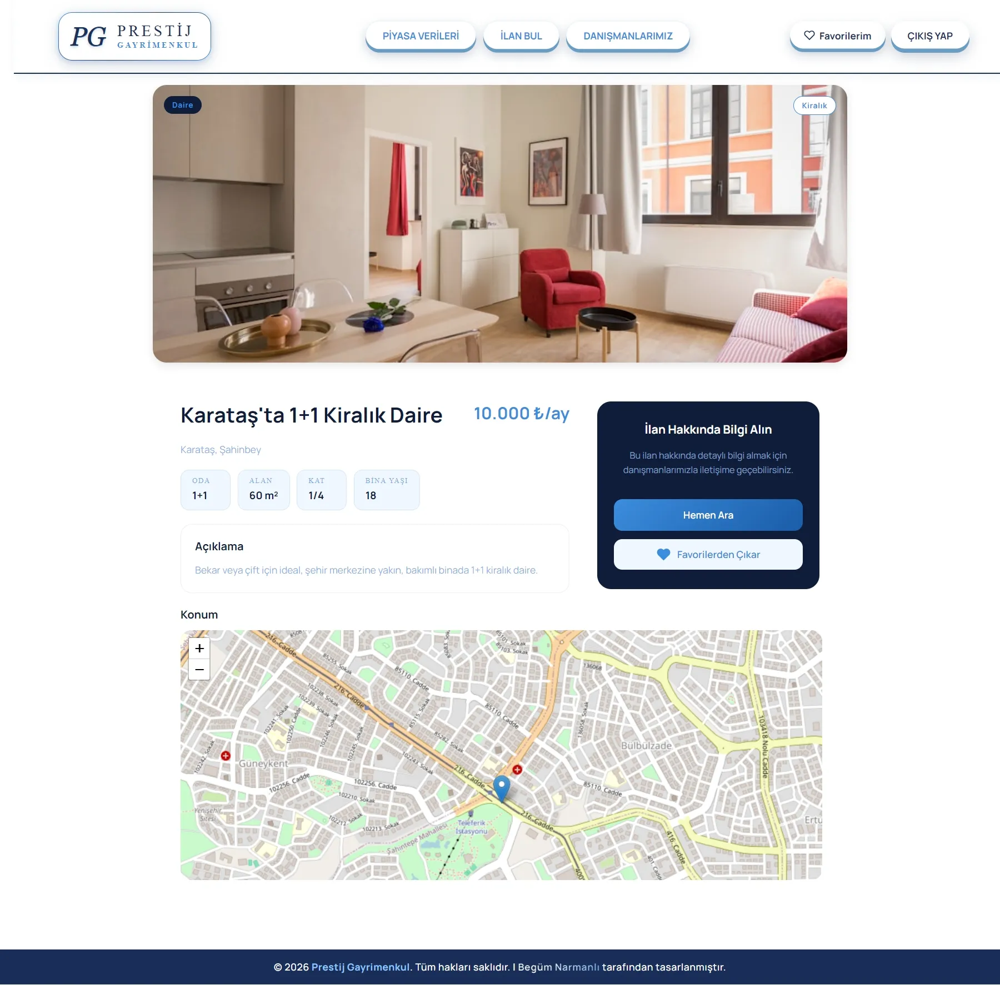
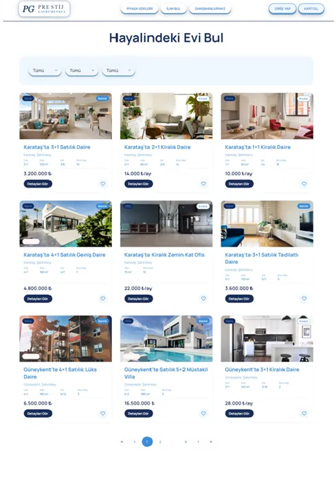

# Prestij Gayrimenkul

Gaziantep bölgesi için geliştirilmiş modern bir gayrimenkul platformu. Satılık ve kiralık ilanları keşfedin, favorilerinize ekleyin, danışmanlarımızla iletişime geçin.

## 📸 Ekran Görüntüleri









## 🌟 Özellikler

- **İlan Listeleme:** Satılık ve kiralık ilanları listeleyin ve filtreleyin
- **Gelişmiş Filtreler:** İlçe, emlak tipi ve ilan tipine göre filtreleyin
- **Kullanıcı Profili:** Profilinizi yönetin ve favori ilanlarınıza ulaşın
- **Favoriler Sistemi:** Beğendiğiniz ilanları favorilerinize ekleyin
- **Danışman Ağı:** Uzman gayrimenkul danışmanlarımızla iletişime geçin
- **Piyasa Verileri:** Mahallelere göre m² fiyatları ve piyasa trendlerini analiz edin
- **Konum Haritası:** İlan detay sayfasında interaktif harita görünümü
- **Duyarlı Tasarım:** Mobil, tablet ve masaüstü uyumlu arayüz

## 🚀 Teknoloji Yığını

- **Frontend:** React 18
- **Build Aracı:** Vite
- **State Yönetimi:** Redux Toolkit
- **Yönlendirme:** React Router v6
- **Form Doğrulama:** React Hook Form + Yup
- **Stil:** CSS Modules
- **Veritabanı:** Firebase Firestore
- **Kimlik Doğrulama:** Firebase Authentication
- **Harita:** React Leaflet
- **Grafikler:** Chart.js
- **Bildirimler:** React Toastify

## 📱 Duyarlı Tasarım Kırılma Noktaları

- **Mobil:** 320px - 767px
- **Tablet:** 768px - 1023px
- **Masaüstü:** 1024px+

## 🛠️ Kurulum

```bash
git clone https://github.com/begumnarmanli/prestij-gayrimenkul.git
cd prestij-gayrimenkul
npm install
npm run dev
```

## 🔐 Ortam Değişkenleri

Kök dizinde `.env` dosyası oluşturun:

```env
VITE_FIREBASE_API_KEY=...
VITE_FIREBASE_AUTH_DOMAIN=...
VITE_FIREBASE_PROJECT_ID=...
VITE_FIREBASE_STORAGE_BUCKET=...
VITE_FIREBASE_MESSAGING_SENDER_ID=...
VITE_FIREBASE_APP_ID=...
```

## ⚠️ Not

Bu proje bir portfolyo çalışmasıdır. Tüm ilan, danışman ve piyasa verileri simülasyon amaçlıdır, gerçeği yansıtmaz.

## 🎨 Tasarım

- **Ana Renk:** Lacivert `#1A2E5A`
- **Vurgu Rengi:** Mavi `#3B8DDD`
- **Font:** Manrope

## 👩‍💻 Geliştirici

**Begüm Narmanlı**

- GitHub: [@begumnarmanli](https://github.com/begumnarmanli)

## 📄 Lisans

MIT License
